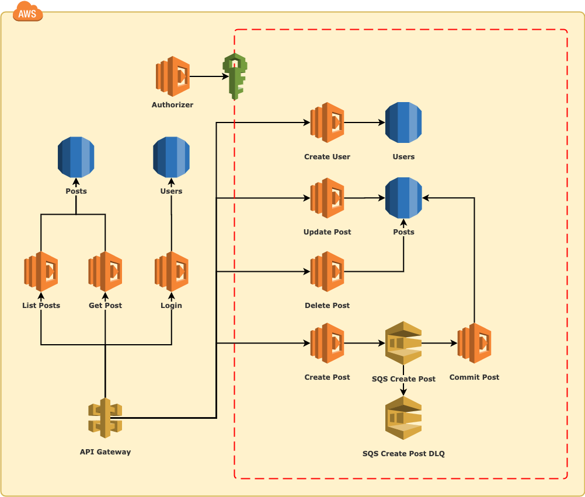

# Aws-Cms-Serverless

## Overview

This project was created with the purpose to deploy a servless infrastructure using the most performatic aws technologies currencly, like lambda functions, SQS , AuroraDB, and others to provide a hight scalabilyty and 100% uptime project in any scenary.

In time, to provider all this structure in a simple way, this project uses Terraform to manage the infrastructure as a code and Serverless Framework to manage lambda functions, that is, simplify the deployment of all these technologies for you.

---

## How it works

This document is intended to guide you step by step to deploy this serverless application on your AWS server, so follow all the steps below to get it done.

---

## The project application

This project contains a basic approach of using some AWS resources like `API Gateway`, `Lambda Functions`, `RDS AuroraDB`, and `SQS`. 

The application consists in a basic CMS (Content Management System) with a default user admin who can create new users with access permissions. The users can create, update and delete cms posts according with itself permissions. List and Get posts has public access for internet.

In an particular approach to make use of SQS, everytime that an user create a new post, the post will be sent to a SQS queue to be processed asynchronous by another Lambda Function, the (`Commit Post`).

Below you can see the diagram about how the architecture of the solution must to be.



--- 

## 1 - Setup your environment

### 1.1 - Setup NodeJS and NPM

In the first of all, this project was developed using node.js and npm (node package manager), so you have to make sure to have this installed and configured in your environment.

_After install `node.js` and `npm`, run the code below to initialize the package and install all dependencies for this project:_

```bash
$ npm install
```

For more documentation about npm, see [this link](https://www.npmjs.com/get-npm.).

---

### 1.3 - Setup NPX

To make simple the execution of all binary libraries in this project like `serverless` and `sequelize`, just install the library below as global, this will take care about de cli executions. 

```bash
$ npm install -g npx
```

---

### 1.2 - Setup your AWS access

You will need to generate IAM credentials at AWS Panel to access it programmatically and allow Serverless and Terraform access.

_Make sure to allow `Programmatic access` and provide `AdministratorAccess` to this user for Serverless and Terraform be able to manage this infrastructure_

For more documentation about IAM creation, see [this link](https://docs.aws.amazon.com/sdk-for-javascript/v2/developer-guide/getting-your-credentials.html).

Now, this project uses shared credentials file to get access of your IAM credentials. Where you keep the shared credentials file depends on your operating system:

* The shared credentials file on Linux, Unix, and macOS: `~/.aws/credentials`
* The shared credentials file on Windows: `C:\Users\USER_NAME\.aws\credentials`

_So, after generate your credential file, put it inside your aws shared credentials file_

Once you follow those instructions, you should see text similar to the following in the credentials file, where `<YOUR_ACCESS_KEY_ID>` is your access key ID and `<YOUR_SECRET_ACCESS_KEY>` is your secret access key:

```txt
[default]
aws_access_key_id = <YOUR_ACCESS_KEY_ID>
aws_secret_access_key = <YOUR_SECRET_ACCESS_KEY>
```

---

### 1.3 - Configure Serverless credentials

For now, we must have the `serverless cli` available to execute some configurations, so make sure to setup your aws credentials with command below (_just for security_):

```bash
$ npx serverless config credentials -o --provider aws -key=<YOUR_AWS_ACCESS_KEY> --secret=<YOUR_AWS_SECRET_ACCESS_KEY>
```

For more knowledge about serverless, see the docs at [serverless](https://www.serverless.com/framework/docs/).

---

### 1.4 - Install Terraform cli

Now, you will need to install terraform executable to manage your infrastructure as a code, so follow these steps:

- Access [this link](https://www.terraform.io/downloads.html)
- Download the appropriate package
- Unzip it
- Add terraform executable to yout path

_When you're done, you will be able to run `terraform` cli command._

```bash
$ terraform
Usage: terraform [--version] [--help] <command> [args]
```

For more knowledge about terraform, check the [./terraform/README.md](./terraform/README.md) as a fast documentation.

For this project we going to use the [AWS](https://www.terraform.io/docs/providers/aws/index.html) provider.

On the final step, access the terraform.tf file and make sure that the value of provider `aws.shared_credentials_file` is the same of yours OS system, this is setted for _Linux, Unix, and macOS_ by default.

---

## 2 - Deploying everything

### 2.1 - Deploy the infrastructure to AWS with Terraform

To start deploy, the first service we need to release is `terraform`, it will able us to enable SQS and RDS resources for execute the next steps.

_1 - initialize the terraform in this project to download all aws plugins needed to work:_

```bash
terraform init
```

_2 - To see what going to be modified in yours aws, just run:_

```bash
terraform plan
```

_3 - Now, if everithing is ok on the plan, lets apply it:_

```bash
terraform apply
```

_if everything occurred ok, now you have the infrastructure online in your aws account._

---

### 2.2 - Deploying our database structure with Sequelize

Now, we should have the RDS online, so we can run sequelize commands to initialize our database and records on server.

__Before run the next commands, just follow one more step:__

_Run terraform command below to get generated variables when terrafor was deployed:_

```bash
$ terraform show
```

Now copy `aws_rds_cluster_instance.cluster_instances.endpoint` variable to `DB_HOST` parameter on `.env` file for node.js access it and have access to correct resources at `aws`.

__also__

copy `aws_sqs_queue.aws-cms-serverless-queue.id` variable to `SQS_URL` parameter on `.env` file for node.js access it and have access to correct resources at `aws`.

Now you can keep going.

---

_2.2.1 Run this command to create the database on server._

```bash
$ npx sequelize db:create
```

_2.2.2 Run this command to create all tables in database._

```bash
$ npx sequelize db:migrate
```

_2.2.3 Run this command to create default records on database tables._

```bash
$ npx sequelize db:seed:all
```

---

### 2.3 - Deploy lambda functions with Serverless

As the last serve to release, we going to deploy serverless that will upload all ours lambda functions and integrate with others services deployed before.

To deploy all the lambda functions located at `src/app/functions` folder, you just need to run the command below, and you're done.

```bash
$ npx serverless deploy -v
```

_With it, all the source code that will represents our API will be online to be consumed._

---

## 3 - Testing

### 3.1 - Invoke your functions locally

For test your lambda functions without an endpoint API, you can invoke it functions using `serverless invoke local`, like code below where `status` is yours function name:

```bash
$ npx serverless invoke local -f status
```

---

### 3.2 - Testing with jest

For test all routes and be safe about new changes, I prepared a  script on `package.json` scripts to join `serverless-offline` and `jest` locally. Run the command below to test it yourself. 

```bash
$ npm run test
```

---

### 3.3 - `serverless OFFLINE` with `Postman`

For this section we going to test the serverless lambda functions offline as a endpoint API, it should be a good pratice to test the project manually during development. I prepared a script at `package.json` scripts to deploy a local server and test it during development joined with postman, so run the command below to start the serverless offline if you want:

```bash
$ npm run dev
```

_this project has two files exporteds from `postman`: [postman_environment.json](postman_environment.json) and [postman_collection.json](postman_collection.json), so you just need to import it to your `postman` and test the application_.

_For develpment tests, make sure that the variable `baseurl` is setted to http://localhost:4000_

---

### 3.4 - `serverless ONLINE` with `Postman`

In the end, the tests before was made in local machine and not was used the infrastructure deployed by terraform and serverless to work. Now to test all the service online is simple, you just need to change the `baseurl` variable on `Postman` to the serverless baseurl genereted when deployed.  

_Run the command bellow to see the endpoint at `endpoints` records:_

```bash
$ serverless info
```

_Now copy the first `GET`- `endpoint` record and replace the variable `baseurl` at postman to test it online._

_After that you will be able to test all deployed lambda resources online._

---


## _🎉  Congradulations, You're done._

I hope this documentation is clear and helps you understand how to configure a serverless application with terraform.

---

## License

[](LICENSE)

Copyright (c) 2020 André Ciornavei

Permission is hereby granted, free of charge, to any person obtaining a copy
of this software and associated documentation files (the "Software"), to deal
in the Software without restriction, including without limitation the rights
to use, copy, modify, merge, publish, distribute, sublicense, and/or sell
copies of the Software, and to permit persons to whom the Software is
furnished to do so, subject to the following conditions:

The above copyright notice and this permission notice shall be included in all
copies or substantial portions of the Software.

THE SOFTWARE IS PROVIDED "AS IS", WITHOUT WARRANTY OF ANY KIND, EXPRESS OR
IMPLIED, INCLUDING BUT NOT LIMITED TO THE WARRANTIES OF MERCHANTABILITY,
FITNESS FOR A PARTICULAR PURPOSE AND NONINFRINGEMENT. IN NO EVENT SHALL THE
AUTHORS OR COPYRIGHT HOLDERS BE LIABLE FOR ANY CLAIM, DAMAGES OR OTHER
LIABILITY, WHETHER IN AN ACTION OF CONTRACT, TORT OR OTHERWISE, ARISING FROM,
OUT OF OR IN CONNECTION WITH THE SOFTWARE OR THE USE OR OTHER DEALINGS IN THE
SOFTWARE.